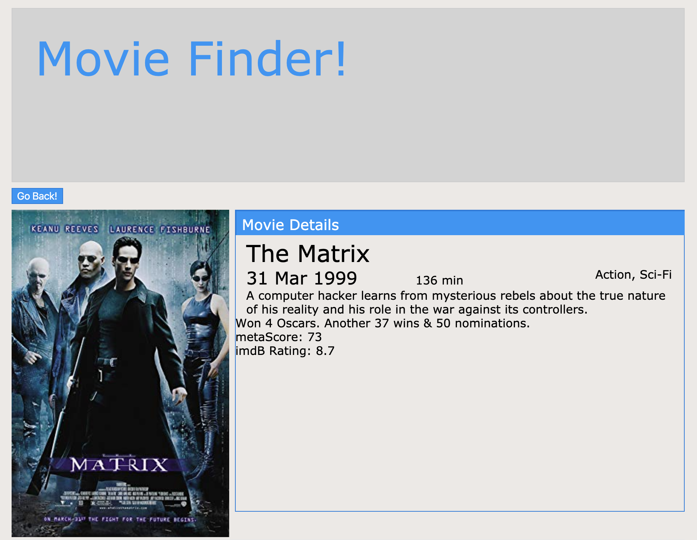

# React200-Movie-Finder




This is a React w/Redux project that implements React Router to view another component on a second page as 
displayed above via the "More Info" button. It also uses Axios to make the API call on the server side to 
the 'Online Movie Database' website for to use integrated in with the search bar where you can type in movie 
names, actors, etc. also if you have already searched for it recently it will pull it from the data cache 
to save hitting the api call so frequently.

## Please feel free to demo the project by taking these steps..
```
Clone or fork the repo
```
```
npm install
```
```
npm start
```
```
Open your browser to view on localhost: 3000
```
* **Thank you**, ***-Miles Mickelson***
